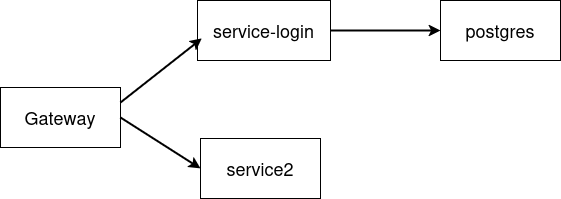
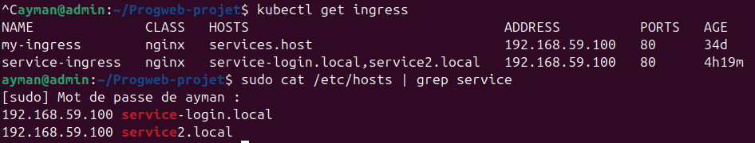
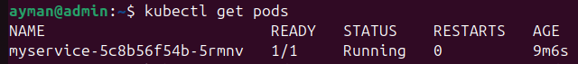
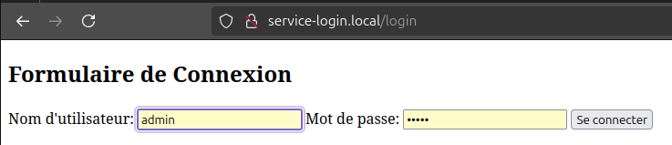

Schéma du projet:

Nous avons une gateway ingress permettant de rediriger le traffic vers les bons services.

Chaque service a un pod et il y'a aussi un pod pour la base postgres qui sera utilisée.

Le premier service propose une page web à /login, connectée à une base PostgreSQL initialisée automatiquement, permettant de tester l’authentification d’utilisateurs via une interface simple.
Ce service est disponible sous une image docker sur dockerhub: https://hub.docker.com/r/atiyah/service_login

Le deuxième service est une page affichant Hello World à /hello disponible à: https://hub.docker.com/r/navdeep00/service2

