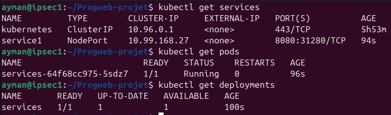

Le premier service propose une page de connexion web sécurisée, connectée à une base PostgreSQL initialisée automatiquement, permettant de tester l’authentification d’utilisateurs via une interface simple.
Ce service est disponible sous une image docker sur dockerhub: https://hub.docker.com/r/atiyah/service_login

Le deuxième service est une page affichant Hello World disponible à: https://hub.docker.com/r/navdeep00/service2

Et l'application tourne bien:

